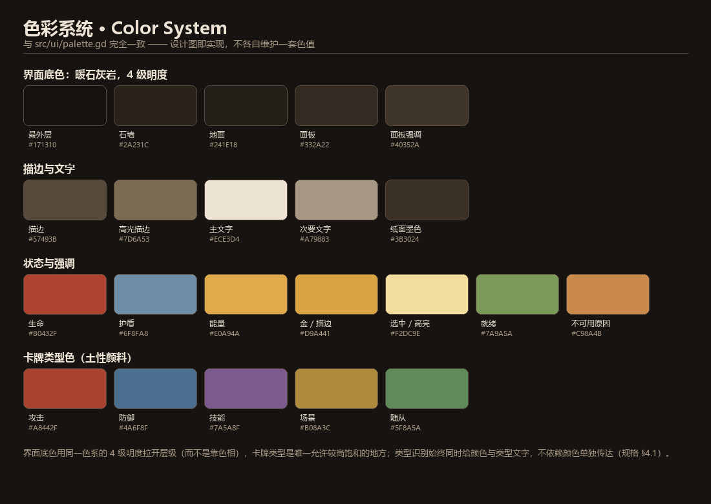
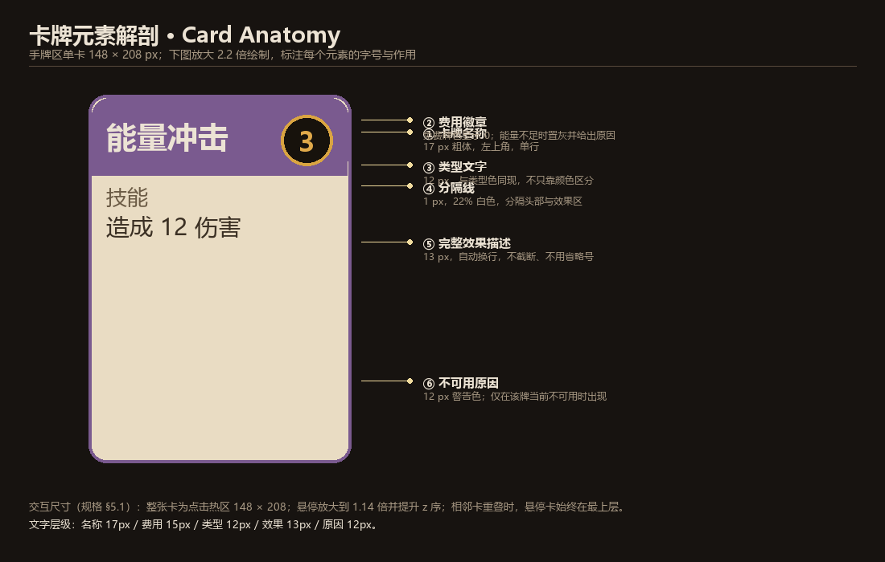
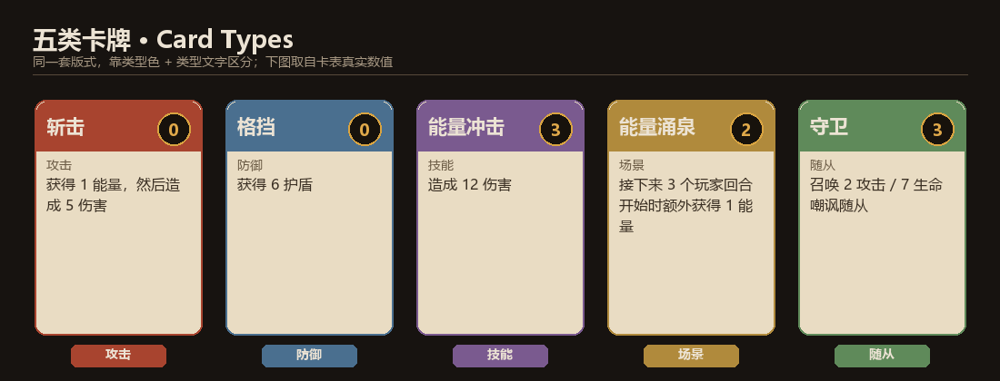
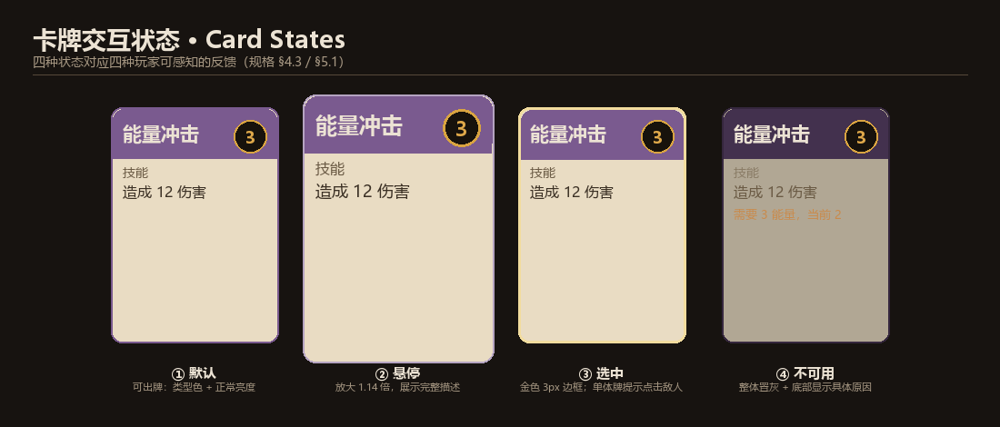
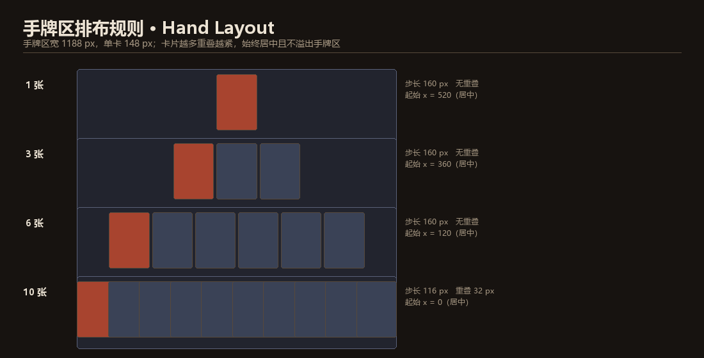
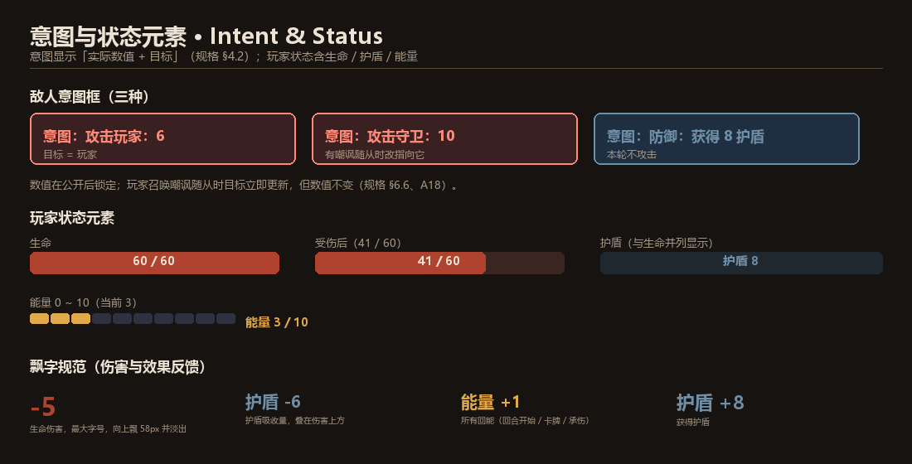
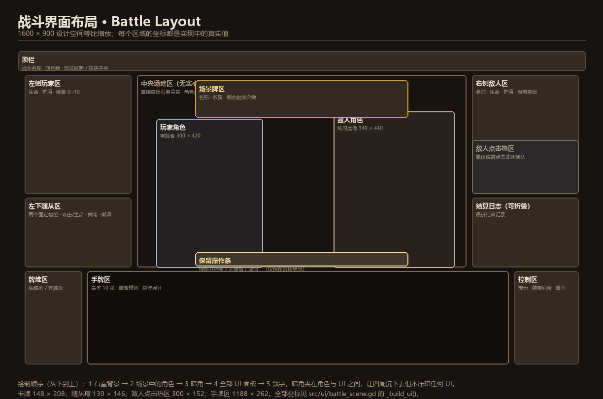
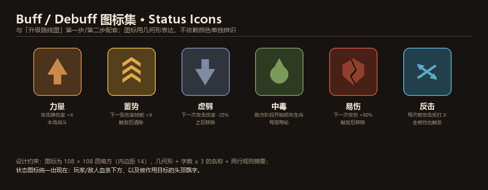
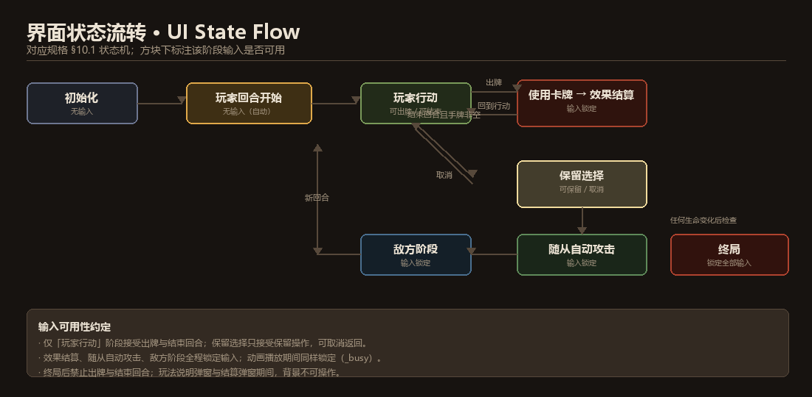

# PVE 卡牌战斗 Demo · 元素设计文档

> 本文覆盖游戏**全部视觉与交互元素**（含 UI），每个元素都配图解释设计意图。
> 配图由 `tools/make_design_assets.py` 生成（PNG 预览 + SVG 可编辑源），色值与尺寸**直接取自实现代码**，
> 并由 `tools/verify_design_assets.py` 自动校验「图 = 代码」，不会各说各话。

**配图与实现的对应关系**

| 配图 | 对应实现 |
|---|---|
| 色彩系统 | `src/ui/palette.gd` |
| 卡牌解剖 / 五类卡牌 / 交互状态 | `src/ui/card_view.gd` |
| 手牌排布 | `src/ui/battle_scene.gd` 的 `_refresh_hand()` |
| 随从槽 | `src/ui/minion_view.gd` |
| 战斗界面布局 | `src/ui/battle_scene.gd` 的 `_build_ui()`（坐标逐一核对） |
| 界面状态流转 | 规格 §10.1 状态机 |

---

## 美术资源与本次视觉改造

本次把 UI 从「深蓝黑 + 霓虹色 + 硬边框面板」重做为**暖石灰岩 + 羊皮纸 + 土性颜料色**。

| 资源 | 尺寸 | 生成方式 | 内容 |
|---|---|---|---|
| `assets/art/bg_ruins.png` | 1600×900 | `tools/make_art_assets.py` | 石室：拱门、远近石柱、地面透视、两团火把暖光、颗粒、暗角 |
| `assets/art/vignette.png` | 1600×900 RGBA | 同上 | 暗角叠加：中心 alpha 0，边缘 92% |
| `assets/art/char_adventurer.png` | 300×420 | 同上 | 冒险者：兜帽剪影 + 轮廓光 + 木杖与杖头光 |
| `assets/art/char_golem.png` | 340×440 | 同上 | 练习魔像：石块躯干 + 余烬眼 + 胸口核心 + 苔藓 |

> 资产是**代码生成**的（Pillow，形状在 2~4 倍分辨率下绘制再 LANCZOS 缩小以保证边缘柔和）。
> 好处是可版本管理、可重新生成；`tools/verify_art_assets.py` 会校验尺寸、亮度层次、
> 暗角渐变，以及**角色在背景上的可辨识度**。

**三个关键设计决定**

1. **角色站在场景里，不塞进状态面板。** 上一版玩家/敌人面板里是一行「（图形占位角色）」文字；
   现在角色作为立绘站在中央场地（`390,190` 与 `890,170`），两侧面板只承担数值。
2. **去掉中央场地的实心面板**，直接露出石室背景 —— 画面才有空气感，而不是一堆矩形。
3. **暗角夹在角色与 UI 之间**，只压环境、不压 UI 文字。

**角色可辨识度经过量化校验**：两个角色与身后背景的亮度差分别为 **24.9** 和 **30.7**（阈值 18）。
最初冒险者的斗篷与石墙亮度只差 **9.8**、会糊在一起 —— 因此提亮了布料、加强了轮廓光，
并给剪影加了一圈暗色外描边。这个问题是校验脚本发现的，不是靠肉眼。

---

# 一、设计原则与视觉方向

来自规格 §4.1，是后面所有元素设计的依据：

| 原则 | 具体做法 |
|---|---|
| **低对比环境，高对比主体** | 石室背景压暗（`#171310` ~ `#2a231c`），卡牌用羊皮纸亮面、角色用轮廓光，保证主体一眼可辨 |
| **不依赖颜色单独传达信息** | 卡牌类型同时给「颜色 + 类型文字」；意图同时给「颜色 + 文字描述」 |
| **数值必须可读** | 生命、意图、费用、能量、剩余触发次数在任何时候都清晰可读，不藏在悬停里 |
| **动画不影响规则** | 所有演出可跳过；提供「快速」开关；结算期间锁定输入 |
| **用光影代替边框** | 面板靠柔和投影与半透明石材分层，而不是靠粗描边；环境层（背景 / 暗角）承担氛围 |
| **设计空间固定** | 1600 × 900（最低 1280 × 720），拉伸模式 `canvas_items` + `keep`，保证布局不漂移 |

---

# 二、色彩系统



**为什么这样分色**

- **界面底色**用同一色系的 4 级灰阶（`BG` → `PANEL` → `PANEL_HI` → `BORDER`），靠明度而不是靠色相区分层级，背景才不会和卡牌抢注意力。
- **卡牌类型色**是唯一允许高饱和的地方，因为它是玩家在 0.5 秒内最需要识别的东西。
- **`SELECT` 金色只用于「当前选中/关键提示」**，全局出现频率极低，所以一旦出现就必然意味着「你正在操作它」。
- **`WARN` 橙色专门给「不可用原因」**，和错误状态区分开 —— 费用不足是提示，不是错误。

| 用途 | 色值 | 说明 |
|---|---|---|
| 最外层 / 远墙 | `#171310` | 暖褐黑，低对比 |
| 石墙 | `#2a231c` | 背景石材 |
| 地面 | `#241e18` | 比石墙略深，形成「地面」感 |
| 面板 | `#332a22` | 以 84% 不透明度使用，让火光与石纹透出来 |
| 面板强调 | `#40352a` | 按钮、次级面板 |
| 描边 | `#57493b` | 1~2 px，暖灰 |
| 高光描边 | `#7d6a53` | 面板顶边与重要分区 |
| 主文字 | `#ece3d4` | 暖白，接近羊皮纸 |
| 次要文字 | `#a79883` | 说明、日志、副标题 |
| 纸面墨色 | `#3b3024` | **羊皮纸卡面上的正文色** |
| 金（描边 / 费用） | `#d9a441` | 费用徽章、场景牌描边 |
| 选中/高亮 | `#f2dc9e` | 浅金，比金更亮，用于选中态 |
| 生命 | `#b0432f` | 陶土红；底色 `#3a2620` |
| 护盾 | `#6f8fa8` | 雾蓝，与生命明确区分 |
| 能量 | `#e0a94a` | 琥珀，费用数字与能量格统一用它 |
| 就绪/正向 | `#7a9a5a` | 苔绿，随从可攻击状态 |
| 警告/原因 | `#c98a4b` | 赭石，卡牌不可用原因 |
| 嘲讽 | `#c9924a` | 嘲讽标记 |
| 羊皮纸 | `#e9dcc3` | 卡面底色 |
| 纸边 | `#c9b691` | 纸面暗部 |
| 攻击牌 | `#a8442f` | 赭红（朱砂） |
| 防御牌 | `#4a6f8f` | 石青 |
| 技能牌 | `#7a5a8f` | 紫藤 |
| 场景牌 | `#b08a3c` | 金褐 |
| 随从牌 | `#5f8a5a` | 苔绿 |

**这一版与上一版的区别**：上一版是「深蓝黑背景 + 高饱和霓虹色 + 大量硬边框面板」，读起来像调试界面。
现在改成**暖石灰岩 + 羊皮纸 + 土性颜料色**：界面底色全部落在同一色系（暖褐）的 4 级明度上，
靠**明度**而不是色相拉开层级；饱和度只留给卡牌类型（朱砂 / 石青 / 紫藤 / 金褐 / 苔绿）。

---

# 三、字体与字号层级

**中文字体是一个必须处理的现实问题**：Godot 内置默认字体不含 CJK 字形，直接用中文会渲染成方块。
实现上通过 `SystemFont` 挂载系统字体（见 `palette.gd` 的 `make_cjk_font()`）：

```
Microsoft YaHei → 微软雅黑 → SimHei → 黑体 → Noto Sans CJK SC
→ PingFang SC → Hiragino Sans GB → WenQuanYi Micro Hei → sans-serif
```

| 层级 | 字号 | 字重 | 用途 |
|---|---:|---|---|
| 弹窗标题 | 30 px | Bold | 战斗胜利 / 挑战失败 |
| 场景标题 | 20 px | Bold | 顶栏「遗迹入口 · 石制守卫」、回合数 |
| 卡牌名称 | 17 px | Bold | 卡面左上角 |
| 意图文字 | 16~17 px | Bold | 用意图色 |
| 面板标题 | 18 px | Bold | 玩家 / 魔像 / 随从区 |
| 卡牌费用 | 15 px | Bold | 费用徽章内 |
| 数值文本 | 15 px | Normal | 生命 `60 / 60`、能量 `3 / 10` |
| 说明文字 | 13~14 px | Normal | 场景描述、图例、操作提示 |
| 卡牌效果 | 13 px | Normal | 自动换行，不截断 |
| 卡牌类型 / 原因 | 12 px | Normal | 类型文字、不可用原因 |
| 日志 | 12 px | Normal | 次要色，可折叠 |

字号差基本保持 **≥ 2 px 一档**，避免读者分不清层级。

---

# 四、卡牌元素

## 4.1 卡牌解剖



单卡 **148 × 208 px**，是手牌区唯一可点击热区。六个元素各自解决一个问题：

| # | 元素 | 尺寸/样式 | 解决的问题 |
|---|---|---|---|
| ① | **卡牌名称** | 17 px 粗体，左上 | 最快识别「这是什么牌」 |
| ② | **费用徽章** | 26 px 圆形，能量色描边 | 决定能不能出；**免费牌也显示 0**，不省略 |
| ③ | **类型文字** | 12 px，与类型色同现 | 色盲/低饱和屏下仍可判断类型 |
| ④ | **类型色卡头** | 高 21% 卡面，类型色，上两角圆角 | 让类型在余光里就能被识别，替代旧版的分隔线 |
| ⑤ | **完整效果描述** | 13 px，自动换行 | **不截断、不用省略号**，卡牌游戏的规则必须完整可读 |
| ⑥ | **不可用原因** | 12 px，警告色 | 费用不足 / 槽位已满 / 无合法目标 —— 给出**具体**原因而不是灰掉了事 |

## 4.2 五类卡牌



五类共用同一套版式，**只有类型色和文字变**。这是刻意的：版式越统一，玩家越不需要重新学习。
图中五张卡取自真实卡表（斩击 / 格挡 / 能量冲击 / 能量涌泉 / 守卫）。

类型差异也体现在**目标类型**上（设计上要在卡面文字里说清）：

| 类型 | 目标 | 出牌方式 |
|---|---|---|
| 攻击 | 单个敌人 | 点卡选中 → 点敌人确认 |
| 防御 | 自身 | 点卡选中 → 再次点击卡牌 / 点「确认使用」 |
| 技能 | 单个敌人 或 无 | 同上，按卡而定 |
| 场景 | 场景槽 | 直接确认；**新场景立即替换旧场景** |
| 随从 | 空随从槽 | 直接确认；**召唤当回合不能攻击** |

## 4.3 卡牌交互状态



四种状态对应四种**玩家能感知到的反馈**：

| 状态 | 视觉 | 交互含义 |
|---|---|---|
| ① 默认 | 类型色 + 正常亮度 | 可出牌 |
| ② 悬停 | 放大 1.14 倍、提升 z 序 | 完整描述可见；重叠的手牌里被悬停的始终在最上 |
| ③ 选中 | 金色 3 px 边框 | 已进入待确认态；单体牌会提示「请点击魔像确认使用」 |
| ④ 不可用 | 整体置灰 + 底部具体原因 | 点击时在场地中央飘出同一条原因 |

**取消方式**（规格 §5.1）：右键、Esc、点击空白处 —— 三者等价，都回到未选中态，且**不移牌、不回能**。

## 4.4 手牌区排布



手牌区宽 **1188 px**，单卡 148 px，步长公式：

```
step = min(148 + 12, (1188 - 148) / (n - 1))      n > 1
x0   = (1188 - (148 + step * (n - 1))) / 2        整体居中
```

| 手牌数 | 步长 | 重叠 | 效果 |
|---:|---:|---:|---|
| 1 | — | 无 | 居中 |
| 3 | 160 px | 无 | 宽松排布 |
| 6 | 160 px | 无 | 仍不重叠 |
| 10 | 115.6 px | 32.4 px | 重叠排列，靠悬停展开 |

**上限 10 张**（规格 §4.2 / §6.3）：超出上限的牌**仍从牌库移出**，然后直接进入弃牌堆 —— 这一点必须在界面上有反馈，否则玩家会以为牌没抽到。

---

# 五、玩家状态元素



| 元素 | 规格 | 设计意图 |
|---|---|---|
| **生命** | 264 × 26 血条 + `当前 / 最大` 文本 | 数值永远显示成 `60 / 60` 形式，不让玩家自己算 |
| **护盾** | 独立一行，护盾色文字 | **不画成第二根血条** —— 护盾和生命是两种资源，混在一起的条会误导 |
| **能量** | `能量 N / 10` + 10 格能量条 | 10 格是因为**上限就是 10**，格子化让「离爆发还差几点」一眼可见 |
| **随从** | 两个固定槽位 130 × 146 | 固定槽位而不是动态列表，让「还剩几个位置」成为稳定认知 |

**为什么血条同时给条和数字**：条用于快速感知，数字用于精确决策（「我再挨 6 点会不会死」）。

---

# 六、敌人元素与意图


意图框显示 **实际数值 + 目标**（规格 §4.2）：

| 意图 | 显示 | 底色/描边 |
|---|---|---|
| 攻击玩家 | `攻击玩家：6` | 红底红框 |
| 攻击随从 | `攻击守卫：10` | 红底红框，目标名取随从卡名 |
| 防御 | `防御：获得 8 护盾` | 蓝底蓝框 |

**两条必须遵守的规则**：

1. **数值在公开后锁定**，但**目标实时更新** —— 玩家召唤嘲讽随从后，意图立刻变成「攻击守卫：6」，数值仍是 6（规格 §6.6、验收 A18）。
2. **敌人点击热区 300 × 152**：即使场上只有一个敌人，单体牌也要**点击敌人确认**（规格 §5.1）。绝不做「唯一目标自动选中」这种省一步但会误操作的设计。

**魔像行为循环**（唯一遭遇）：`攻击 6 → 获得 8 护盾 → 攻击 10`。
护盾的清除时机与玩家不对称（玩家在下个玩家回合开始清，魔像在下个敌方阶段开始清），所以魔像的 8 点护盾会保护它**度过玩家的下一整个回合** —— 这一点需要在界面上可读，否则玩家会困惑「为什么打不掉」。

---

# 七、随从元素



随从槽（左下）固定两个，每个 **130 × 146**，显示四类信息：

| 信息 | 显示 |
|---|---|
| 名称 | 卡名（如「守卫」） |
| 数值 | `2 攻击 / 7 生命` |
| 嘲讽标记 | `嘲讽`（嘲讽色），非嘲讽不显示 |
| 就绪状态 | `回合结束自动攻击`（正向色）/ `准备中（本回合不攻击）`（警告色） |

**状态用文字而不是只换颜色**：随从当回合不能攻击是新手最容易误解的点，所以「准备中」必须写出来。

**交互**：点击随从**仅查看说明**，不提供手动攻击指令（规格 §5.2）—— 自动攻击是这个 Demo 的节奏来源，不做成需要操作的东西。

---

# 八、场景牌元素

场景牌显示在中央场地区顶部的独立面板（600 × 104，金色描边）：

| 显示 | 内容 |
|---|---|
| 名称 | `场景：能量涌泉` |
| 效果 | 卡牌的完整描述 |
| 剩余触发次数 | `剩余触发次数：2` |

**无场景时**显示占位文案「无场景牌」+ 一句规则提示（「场上仅能存在一张场景牌，新场景会立即替换旧场景」），让玩家在没有场景时也知道这里是什么。

---

# 九、状态图标（Buff / Debuff）



这一组图标是为**后续升级**（升级路线图第一步/第二步）预先定好的设计规范，当前 Demo 尚未使用。

**设计约束**

- 统一 **108 × 108 圆角方**，内边距 14，圆角 14。
- 用**几何形**表达语义，不靠颜色单独辨识：向上箭头 = 增益、向下箭头 = 减益、水滴 = 持续伤害、裂盾 = 受伤加成、交叉箭头 = 反击。
- 名称 ≤ 3 字，下方两行规则摘要，**必须写清「什么时候清除」**（一次性 / 每轮 / 本场）。

| 图标 | 类型 | 语义 | 清除时机 |
|---|---|---|---|
| 力量 ↑ | 增益 | 攻击牌伤害 +X | 本场战斗 |
| 蓄势 ⇈ | 增益 | 下一张伤害技能 +X | 触发后清除 |
| 虚弱 ↓ | 减益 | 下一次攻击伤害 -25% | 之后移除 |
| 中毒 💧 | 减益 | 敌方阶段开始损失生命 | 每层每轮递减 |
| 易伤 ✦ | 减益 | 下一次受伤 +50% | 触发后清除 |
| 反击 ⤫ | 增益 | 每次被攻击反打 X | 本轮结束 |

**统一的出现位置**：玩家/敌人血条下方一排小图标（按剩余回合排序），以及被作用目标的头顶飘字。

---

# 十、战斗界面布局


1600 × 900 设计空间的完整分区。**图中每个区域的坐标都经过脚本核对，与 `battle_scene.gd` 的实现一致。**

| 区域 | 坐标 (x, y, w, h) | 职责 |
|---|---|---|
| 顶栏 | 0, 0, 1600, 54 | 战斗名称、回合数、玩法说明 / 快速开关 |
| 左侧玩家区 | 20, 66, 300, 336 | 生命、护盾、能量 0~10 |
| 左下随从区 | 20, 412, 300, 196 | 两个固定槽位 |
| 中央场地区 | 336, 66, 928, 542 | **无实心面板**，露出石室背景；角色站于其中，飘字在此 |
| 玩家角色 | 390, 190, 300, 420 | 冒险者立绘（站在场景里，不塞进面板） |
| 敌人角色 | 890, 170, 340, 440 | 练习魔像立绘 |
| 场景牌区 | 500, 82, 600, 104 | 场景名称 / 效果 / 剩余次数 |
| 右侧敌人区 | 1280, 66, 300, 336 | 名称、生命、护盾、当前意图 |
| 敌人点击热区 | 1280, 250, 300, 152 | 单体牌确认目标 |
| 结算日志 | 1280, 412, 300, 196 | 最近结算记录（可折叠） |
| 牌堆区 | 20, 620, 160, 262 | 抽牌堆 / 弃牌堆入口 |
| 手牌区 | 196, 620, 1188, 262 | 最多 10 张 |
| 控制区 | 1400, 620, 180, 262 | 提示、确认使用、结束回合、重开 |
| 保留操作条 | 500, 566, 600, 40 | 仅保留选择阶段显示 |

**绘制顺序（从下到上，必须严格如此）**

```
1  石室背景      bg_ruins.png          1600×900
2  场景中的角色   char_adventurer.png / char_golem.png
3  暗角          vignette.png          1600×900 RGBA
4  全部 UI 面板
5  飘字
```

暗角夹在**角色与 UI 之间**：让四周沉下去、视线集中在中间，同时完全不压暗任何 UI 文字。
上一版没有环境层，中央场地是一块实心面板 —— 这一版把它去掉，背景与角色直接露出。


**布局的三条思路**

1. **左右对峙**：玩家固定左侧、敌人固定右侧。位置不变，玩家不需要每场重新找「我在哪」。
2. **底部是操作区，上部是状态区**：手牌、牌堆、控制全在底部一条带上，视线不需要在屏幕上跳。
3. **中央留给「刚刚发生了什么」**：伤害数字、能量变化、抽牌提示全部在中央场地飘出，因为那是视野中心。

**牌堆查看的两个不同规范**（规格 §4.3）：

- **抽牌堆**：只显示**组成与数量**，不暴露抽取顺序。
- **弃牌堆**：显示**实际内容**，因为弃牌堆是公开信息。

---

# 十一、界面状态流转与输入锁



对应规格 §10.1 的状态机。**输入可用性是这张图最重要的信息**：

| 阶段 | 可用输入 |
|---|---|
| 玩家回合开始 | 无（自动流程） |
| **玩家行动** | 出牌、结束回合 |
| 保留选择 | 选择保留的牌、保留并结束、不保留、取消返回 |
| 效果结算 | **全部锁定** |
| 随从自动攻击 | **全部锁定** |
| 敌方阶段 | **全部锁定** |
| 终局 | **全部锁定**（含结束回合） |
| 弹窗打开期间（玩法说明 / 结算） | 背景不可操作 |

**为什么要显式锁输入**：出牌是「点击 → 确认」两步，如果结算期间还能点，就会出现重复扣费或重复出牌。
实现上用一个 `_busy` 标志统一控制，并且**动画播放期间也算 busy** —— 演出不能成为绕过校验的入口。

**状态机的一句话概括**：

```
玩家行动 ──出牌──→ 效果结算 ──→ 玩家行动
    └──结束回合──→ 保留选择 ──→ 随从自动攻击 ──→ 敌方阶段 ──→ 玩家回合开始
任何生命变化 ──→ 终局检查 ──→ 胜利 / 失败
```

「取消保留」是一条**回到玩家行动**的边，不是回到回合开始 —— 这一点容易实现错。

---

# 十二、反馈与动效

## 12.1 飘字规范

| 飘字 | 颜色 | 字号 | 位置与行为 |
|---|---|---|---|
| `-5`（生命伤害） | 生命红 | 30 px | 目标位置，向上飘 58 px 并淡出，0.95 s |
| `护盾 -6` | 护盾蓝 | 20 px | 叠在伤害数字上方 |
| `护盾 +8` | 护盾蓝 | 22 px | 获得护盾时 |
| `能量 +1` | 能量金 | 20 px | 所有回能：回合开始 / 卡牌效果 / 承伤回能 |
| `抽 N 张` | 主文字 | 20 px | 中央场地 |
| `召唤「守卫」` | 随从绿 | 22 px | 中央场地 |
| `需要 3 能量，当前 2` | 警告橙 | 19 px | 点击不可用卡牌时，在场地中央 |

**设计要点**

- **伤害先出，护盾吸收量叠在其上方** —— 玩家能同时看到「总共挨了多少」和「其中多少被挡掉」。
- **回能一定飘字**。能量是这个游戏最核心的资源，任何来源的 +1 都要让玩家看见，否则玩家无法建立「打攻击牌能回能」的心智模型。
- **飘字绝不参与规则**。伤害由规则层结算一次，飘字只是把事件画出来（规格 §10）。

## 12.2 动效与「快速」开关

- 所有演出都是**非阻塞、可跳过**的；顶栏「快速」开关把演出时长压到 25%。
- 「快速」**只改时长，不改结果** —— 这是硬约束。
- 重开时清空飘字层与未完成动画，防止旧回调写进新战斗（规格 §9、验收 A19）。实现上用「战斗代号 `_token`」让旧协程自行退出。

---

# 十三、弹窗规范

| 弹窗 | 尺寸 | 关键行为 |
|---|---|---|
| **玩法说明** | 760 × 540 | 打开期间**阻止背景操作**；关闭后恢复原状态，**不推进回合**；内容含抽牌 / 免费牌 / 能量 / 敌人意图 / 保留牌五条规则 |
| **胜负结算** | 560 × 320 | 标题（战斗胜利 / 挑战失败）+ 说明 + 使用回合数 + 玩家剩余生命 + 「再来一局」；按钮执行期间禁用，避免重复创建战斗 |
| **牌堆查看** | 620 × 560 | 抽牌堆只列组成 ×数量；弃牌堆列实际内容并带类型色 |

**文案**（规格 §9）

- 胜利：标题「战斗胜利」，说明「你击败了练习魔像」
- 失败：标题「挑战失败」，说明「调整出牌顺序，再试一次」
- 主按钮统一为「**再来一局**」

---

# 十四、文案与提示清单

| 位置 | 文案 |
|---|---|
| 首回合提示 | 敌人本轮将攻击 6；若手中有格挡，可获得护盾抵消伤害。 |
| 默认操作提示 | 点击手牌出牌，然后点「结束回合」。 |
| 选中单体牌 | 已选中「斩击」：点击魔像确认使用；右键 / Esc / 点击空白处取消。 |
| 选中无目标牌 | 已选中「格挡」：再次点击卡牌或点「确认使用」。 |
| 保留阶段 | 结束回合：请点击一张手牌作为要保留的牌，或点「不保留」。 |
| 结算中 | 结算中…（期间锁定输入） |
| 战斗结束 | 战斗已结束。点击「再来一局」重新挑战。 |
| 费用不足 | 需要 3 能量，当前 2 |
| 随从槽满 | 随从槽位已满 |
| 场景占位 | 无场景牌 / 场上仅能存在一张场景牌，新场景会立即替换旧场景。 |
| 槽位空 | 空槽位 1 / 可召唤随从牌 |
| 随从就绪 | 回合结束自动攻击 |
| 随从准备中 | 准备中（本回合不攻击） |

**文案原则**：不可用状态**必须给出具体数字与原因**，不写「条件不满足」这类空话。

---

# 十五、资源清单与命名规范

## 15.1 当前资源状态

| 资源 | 状态 |
|---|---|
| 角色形象（玩家 / 魔像） | **已换成代码生成立绘**：`assets/art/char_adventurer.png`、`char_golem.png`（见「美术资源与本次视觉改造」） |
| 卡面 | **羊皮纸卡面 + 类型色卡头 + 墨色正文**，无插画（刻意的：卡牌游戏里规则文字比插画更重要） |
| 图标 | 无位图图标；状态图标规范已定义（见第九节），待升级时制作 |
| 音效 | **未实现**（规格 §11 第 6 步，属打磨项） |
| 字体 | 依赖系统 CJK 字体；移植到无这些字体的平台需自带字体文件 |

## 15.2 命名规范（接续实现）

```
design/<figure>.png        设计配图预览（文档中嵌入的就是它）
design/<figure>.svg        同名可编辑矢量源
src/ui/<element>_view.gd   界面元素：一个文件一个元素
src/core/<domain>_db.gd    静态配置表
tools/verify_*.py          校验脚本，全部以退出码表示结果
```

**新增元素的流程**：先在本文件补一节设计说明 → 在 `make_design_assets.py` 加一个 `fig_*` → 跑
`verify_design_assets.py` 确认不越界、不空白、坐标与实现一致 → 最后才写实现。

---

# 十六、可读性与无障碍检查表

| 检查项 | 状态 |
|---|---|
| 卡牌类型不只靠颜色（同时有类型文字） | ✅ |
| 敌人意图不只靠颜色（同时有完整文字描述） | ✅ |
| 伤害与护盾用不同色 + 不同数值同时表达 | ✅ |
| 主要文字对比度 ≥ 7:1（`#e9eaf0` on `#141518` 约 13:1） | ✅ |
| 次要文字对比度 ≥ 4.5:1（`#98a0b6` 约 5.9:1） | ✅ |
| 所有数值以「当前 / 最大」成对显示 | ✅ |
| 不可用状态给出具体原因与数字 | ✅ |
| 关键操作有非鼠标路径（Esc 取消） | ✅ |
| 不依赖悬停才能读到规则（卡面始终显示完整效果） | ✅ |
| 中文字形可用性有自动断言 | ✅（`ui_smoke.gd`） |

---

# 附录：重新生成与校验配图

```powershell
# 重新生成全部配图（PNG + SVG）
python tools\make_design_assets.py

# 校验：尺寸 / 边界 / 墨迹 / SVG 合法性 / 中文字形 / 坐标与实现一致
python tools\verify_design_assets.py
```

当前校验结果：**21 项全部通过**，其中包含「布局图 12 个区域的坐标全部能在 `battle_scene.gd` 中找到对应」。
